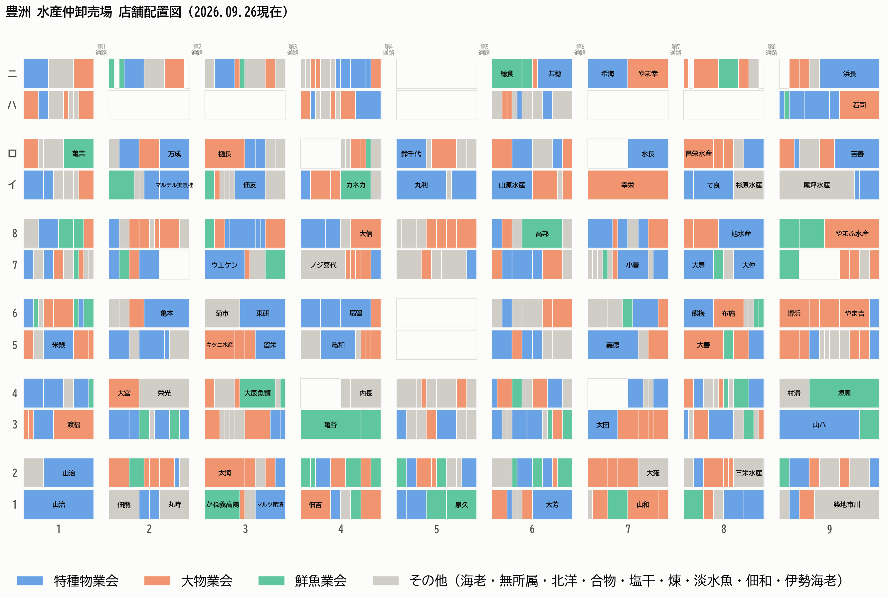

# wholesale



Every 仲卸 stall at its real position on the floor (rows 1–8, イ・ロ・ハ・ニ from
the bottom; block columns 1–9), coloured by 業会. Layout per Tokyo's
[水産仲卸店舗全体配置図](https://www.shijou.metro.tokyo.lg.jp/documents/d/shijou/facility_suinaka-number1pdf);
redraw with `python scripts/plot_block_map.py`.

Personal fish-purchase records at Toyosu market 仲卸 shops, with a shop
master (shop code, name, stall numbers, floor blocks, 業会 groups)
built from https://www.touoroshi.or.jp/store/.

```
python scripts/build_shop_master.py   # refresh shops.csv + stalls.csv from the site
```

`purchases.csv` holds the purchase records.
